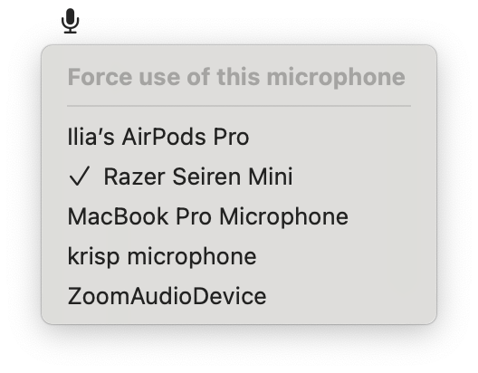

# MicLocker - macOS App

MicLocker is a lightweight menu bar utility for macOS that locks your preferred microphone input device. It prevents macOS from automatically switching your mic (for example, to AirPods) when new audio hardware connects. Simply select your favorite mic from the menu bar, and MicLocker will enforce that choice continuously.

<p align="center">
  
</p>

## Features
- Locks the system default input to your chosen microphone
- Menu bar picker built with SwiftUI's `MenuBarExtra` (no Dock icon)
- Dynamic menu width and aligned checkmarks
- Persists your selection across restarts
- Listens for default-input changes and re-applies your choice in real time
- Console logs for visibility and debugging

## Project Architecture

```
MicLocker/
├── MicLocker.xcworkspace/              # Open this file in Xcode
├── MicLocker.xcodeproj/                # App shell project
├── Config/                             # Build configuration files
│   ├── Debug.xcconfig                  # Debug build settings
│   ├── Release.xcconfig                # Release build settings
│   ├── Shared.xcconfig                 # Shared build settings
│   ├── Tests.xcconfig                  # Test build settings
│   └── MicLocker.entitlements          # App sandbox settings
├── assets/                             # Project assets
│   └── mic-menu.png                    # Menu screenshot
├── MicLocker/                          # App target (minimal)
│   ├── Assets.xcassets/                # App-level assets (icons, colors)
│   │   └── AppIcon.appiconset/         # App icons for all sizes
│   ├── Info.plist                      # App configuration
│   └── MicLockerApp.swift              # App entry point
├── MicLockerPackage/                   # 🚀 Primary development area
│   ├── Package.swift                   # Package configuration
│   ├── Sources/MicLockerFeature/       # Your feature code
│   └── Tests/MicLockerFeatureTests/    # Unit tests
└── MicLockerUITests/                   # UI automation tests
```

## Building & Installation
- Requirements: macOS 15.4 or later, Xcode 16+
- Open `MicLocker.xcworkspace` and build the **MicLocker** scheme.
- To install permanently, copy the built `MicLocker.app` into `/Applications`.

A modern macOS application using a **workspace + SPM package** architecture for clean separation between app shell and feature code.

## Download & Install
1. Download **MicLocker.zip** from the [Releases page](https://github.com/prkl78/MicLocker/releases).
2. Unzip to obtain `MicLocker.app`.  
3. (Optional) Drag `MicLocker.app` into your **Applications** folder for easy access.

## First-Launch Security Warning
Because this build is unsigned by Apple, macOS will show an “unidentified developer” alert on first open and block it. To override:

1. In Finder, locate `MicLocker.app`.  
2. Right-click (or Control-click) and choose **Open**.  
3. In the dialog that appears, click **Open** again.
4. Open the System Settings, go to the Privacy & Security, scroll down and Allow the app to be launched.

Once you’ve bypassed this, future launches will work normally.

## Usage
1. Build and run the app in Xcode or launch the `.app` bundle directly.
2. Click the mic icon in the menu bar.
3. Choose **Force use of this microphone** and select your device.
4. The app will continually enforce your selection, even when new devices (like AirPods) connect.
5. To have an app open automatically when you log in, open System Settings, navigate to General, then select Login Items & Extensions. Click the “+” button and add the app to the “Open at Login” list.

## Notes

### Generated with XcodeBuildMCP
This project was scaffolded using [XcodeBuildMCP](https://github.com/cameroncooke/XcodeBuildMCP), which provides tools for AI-assisted macOS development workflows.